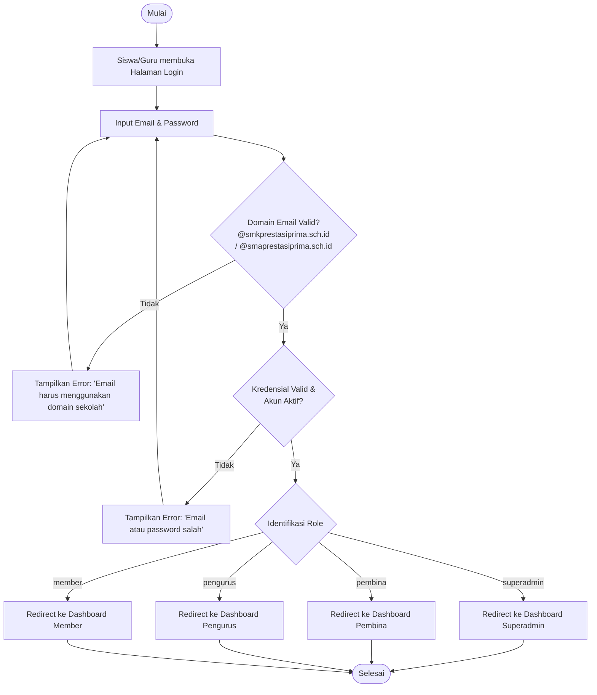
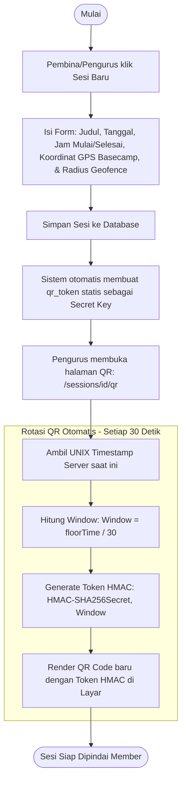
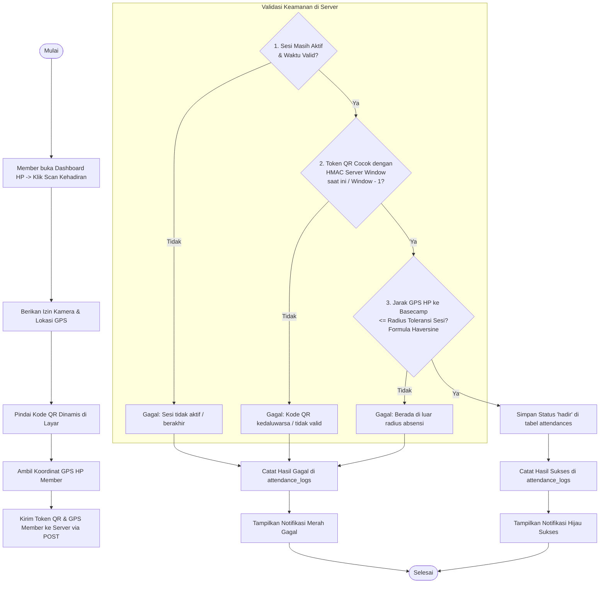
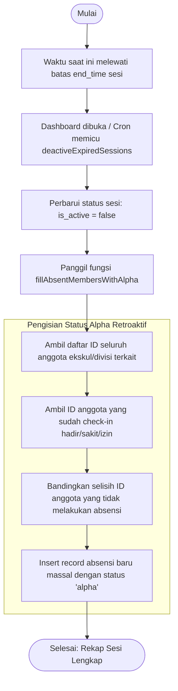
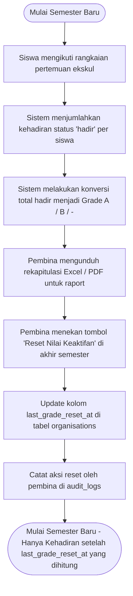

# Alur Kerja & Flowchart Aplikasi - Orens Pro

Sistem Absensi Ekstrakurikuler Cerdas Terverifikasi (Geofenced & Dynamic Rotating QR Code)
Sekolah: SMK & SMA Prestasi Prima, Jakarta
Versi: 2.1 (Ekskul Context)
Tanggal Diperbarui: 18 Juni 2026

---

## 🗺️ 1. Gambaran Umum Peran Pengguna (RBAC Matrix)

Sistem Orens Pro menerapkan kontrol akses berbasis peran (Role-Based Access Control / RBAC) yang terdistribusi secara bertingkat:

| Peran Pengguna | Ruang Lingkup Akses | Fitur Utama |
| :--- | :--- | :--- |
| **Superadmin** | Sistem Global (Multi-Sekolah/Ekskul) | Mengelola data seluruh ekskul, divisi, audit logs global, reset nilai, dan manajemen akun pembina. |
| **Pembina** | Spesifik Satu Ekskul (Induk) | Mengelola divisi ekskulnya, mendaftarkan/mengimpor data siswa, reset nilai keaktifan semesteran, membuat sesi, dan mengunduh laporan komulatif multi-sesi. |
| **Pengurus** | Spesifik Divisi di dalam Ekskul | Membuat sesi pertemuan divisi, mengatur koordinat & radius geofencing, menampilkan layar QR dinamis, dan marking absensi manual. |
| **Member** | Personal (Siswa) | Melakukan check-in mandiri dengan memindai kode QR dinamis di basecamp ekskul dan melihat riwayat kehadiran pribadi. |

---

## 📋 2. Flowchart Alur Utama Aplikasi

### 2.1. Flowchart 1: Alur Autentikasi & Pengalihan Dashboard
Membatasi hak login hanya untuk pengguna dengan email resmi sekolah, lalu mengarahkan mereka ke dashboard khusus peran masing-masing.

---

### 2.2. Flowchart 2: Alur Pembuatan Sesi & Generator QR Dinamis
Proses pembuatan sesi latihan/pertemuan ekskul dan penayangan kode QR terenkripsi yang berotasi otomatis setiap 30 detik.

---

### 2.3. Flowchart 3: Alur Presensi Mandiri & Validasi Keamanan (Server-Side)
Verifikasi berlapis untuk memastikan siswa berada di lokasi basecamp ekskul dan tidak menggunakan screenshot QR hasil titip absen.

---

### 2.4. Flowchart 4: Mekanisme Tutup Sesi & Otomasi Status Alpha
Proses pemeliharaan status absensi terotomatisasi ketika sesi pertemuan berakhir untuk menutup peluang manipulasi data.

---

## 📈 3. Alur Rekapitulasi Laporan & Penilaian Keaktifan

Kehadiran siswa dihitung secara kumulatif untuk menentukan nilai akhir keaktifan ekstrakurikuler (Grade) per semester.

### 3.1. Tabel Konversi Nilai Akhir (Grade)
*   **Total Hadir &ge; 4 Sesi:** Grade **A** (Sangat Aktif)
*   **Total Hadir 2 s.d 3 Sesi:** Grade **B** (Aktif)
*   **Total Hadir < 2 Sesi:** Grade **-** (Kurang Aktif / Kurang Kehadiran)

### 3.2. Flowchart 5: Alur Rekapitulasi & Reset Nilai Keaktifan

---

## 💾 4. Kamus Data & Relasi Skema Database

Struktur tabel di database MySQL/MariaDB yang mendukung operasional sistem Orens Pro:

1.  **organisations (Ekstrakurikuler):** Tabel induk ekskul (contoh: *Orens Solution*).
2.  **divisions (Divisi):** Sub-bidang di bawah ekskul (contoh: *Cyber Security*). Relasi *1-to-many* dari `organisations`.
3.  **users (Pengguna):** Data akun dengan multi-role (`superadmin`, `pembina`, `pengurus`, `member`). Relasi ke `organisations` dan `divisions`.
4.  **attendance_sessions (Sesi Presensi):** Sesi absensi geofenced yang dibuat pengurus. Relasi ke `organisations`, `divisions`, dan `users` (pembuat).
5.  **attendances (Presensi Anggota):** Log status presensi utama (`hadir`, `sakit`, `izin`, `alpha`). Relasi ke `users` (member) dan `attendance_sessions`.
6.  **attendance_logs (Log Pemindaian):** Log audit percobaan scan QR untuk forensik jika terjadi kegagalan sistem.
7.  **audit_logs (Log Aktivitas Admin):** Log audit forensik dari setiap perubahan data yang dipicu oleh admin.
