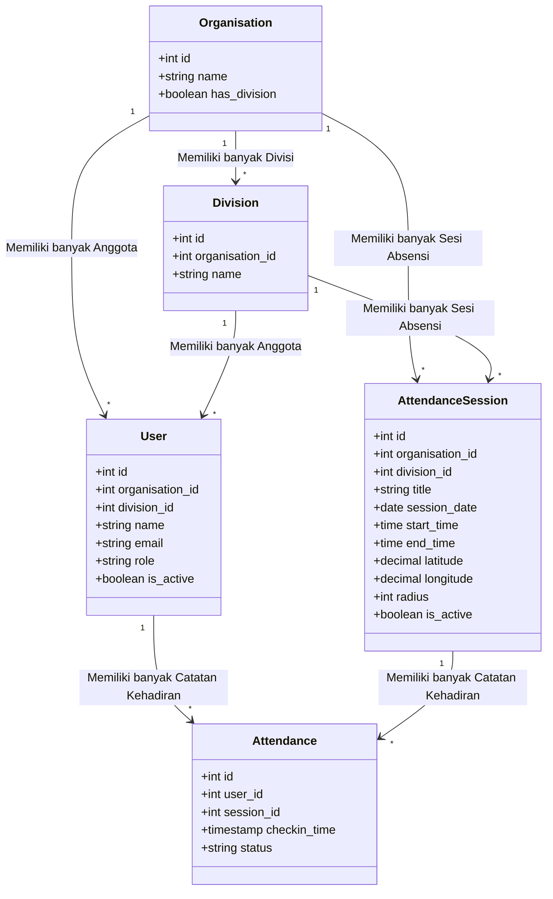

# Orens Pro - UML Class Diagram (Sederhana)

Dokumen ini berisi spesifikasi diagram kelas (Class Diagram) yang disederhanakan untuk aplikasi **Orens Pro**. Diagram ini berfokus pada entitas utama (Core Models) dan relasi penting di dalam sistem.

---

## 1. Kode Mermaid Class Diagram

---

## 2. Penjelasan Singkat Entitas

Berikut adalah penjelasan singkat mengenai 5 entitas utama dalam sistem **Orens Pro**:

1. **Organisation (Organisasi)**:
   * Entitas tingkat teratas yang mewakili organisasi atau institusi.
   * Dapat memiliki beberapa divisi atau langsung memiliki anggota (User) jika tidak menggunakan divisi.

2. **Division (Divisi)**:
   * Entitas di bawah organisasi untuk mengelompokkan anggota berdasarkan divisi/departemen tertentu.

3. **User (Pengguna/Anggota)**:
   * Anggota dari organisasi yang memiliki peran tertentu (`superadmin`, `pembina`, `pengurus`, `member`).
   * Terikat pada satu organisasi dan satu divisi (opsional).

4. **AttendanceSession (Sesi Absensi)**:
   * Sesi presensi yang dibuat oleh pengurus/pembina untuk tanggal, waktu, dan lokasi koordinat (GPS) tertentu dengan radius toleransi tertentu.

5. **Attendance (Kehadiran)**:
   * Catatan kehadiran anggota pada sesi absensi tertentu, menyimpan waktu check-in serta status kehadiran (`hadir`, `terlambat`, `izin`, `sakit`, `alpha`).
