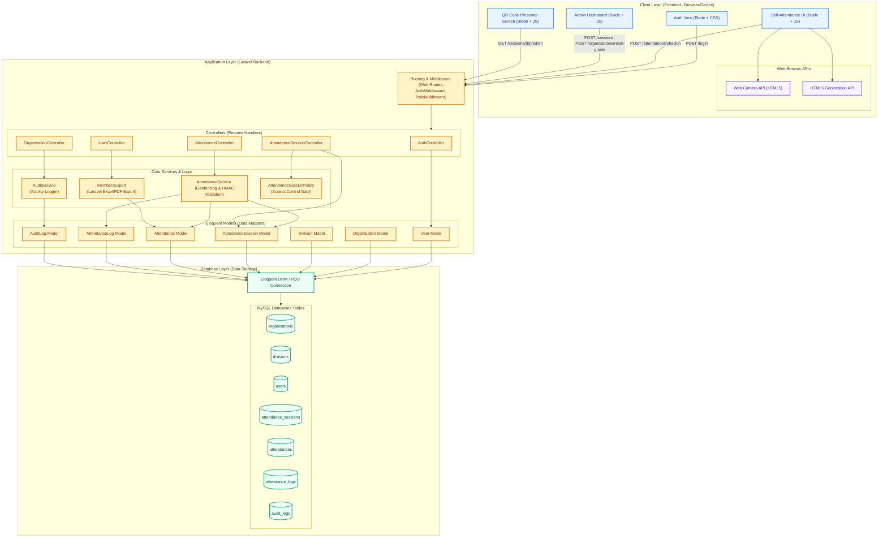

# Orens Pro - UML Component Diagram

Dokumen ini berisi spesifikasi **Component Diagram** untuk arsitektur aplikasi **Orens Pro**. Diagram ini dirancang untuk menunjukkan struktur komponen perangkat lunak (frontend, backend, database, dan API browser), hubungan dependensi, serta antarmuka (interface) yang menghubungkannya.

Anda dapat menyalin kode Mermaid di bawah ini ke editor Markdown pendukung atau [Mermaid Live Editor](https://mermaid.live) untuk visualisasi interaktif yang premium.

---

## 1. Kode Mermaid Component Diagram

---

## 2. Deskripsi Komponen Arsitektur

Arsitektur **Orens Pro** mengadopsi pola arsitektur **Model-View-Controller (MVC)** monolitik yang diperluas dengan **Service Layer Pattern** untuk memisahkan logika bisnis yang kompleks dari Controller.

### 2.1. Client Layer (Frontend - Browser)
Layer ini berjalan sepenuhnya di browser sisi pengguna (siswa, pengurus, pembina, superadmin).
*   **Auth View**: Form login siswa/guru yang memvalidasi format email sebelum dikirim ke server.
*   **Self-Attendance UI**: Panel utama member untuk melakukan absen mandiri. Berinteraksi langsung dengan API bawaan browser:
    *   *HTML5 Geolocation API*: Mengambil data latitude dan longitude GPS perangkat.
    *   *Web Camera API*: Mengaktifkan kamera smartphone untuk memindai QR Code di layar.
*   **Admin Dashboard**: Panel manajemen untuk Pembina, Pengurus, dan Superadmin untuk mengelola ekskul/divisi, mengatur sesi absensi, menandai kehadiran manual, dan melihat rekap log audit.
*   **QR Presenter Screen**: Antarmuka proyektor/layar yang menampilkan kode QR dinamis. Menggunakan JavaScript untuk melakukan polling token baru dari backend setiap 30 detik secara asynchronous.

### 2.2. Application Layer (Laravel Backend)
Layer inti yang memproses semua logika bisnis, validasi keamanan, dan autentikasi.
*   **Routing & Middleware**:
    *   `web.php`: Mendefinisikan endpoint URL aplikasi.
    *   `AuthMiddleware`: Menjamin hanya user terautentikasi yang dapat mengakses sistem.
    *   `RoleMiddleware`: Membatasi akses rute berdasarkan peran (`superadmin`, `pembina`, `pengurus`, `member`).
*   **Controllers (Request Handlers)**:
    *   `AuthController`: Mengatur alur login dan pembatasan domain email sekolah (`@smkprestasiprima.sch.id` / `@smaprestasiprima.sch.id`).
    *   `AttendanceController`: Mengelola input presensi member.
    *   `AttendanceSessionController`: Mengatur pembuatan sesi absen baru dan endpoint polling token QR dinamis.
    *   `UserController` & `OrganisationController`: Mengatur modifikasi data user, struktur organisasi ekskul/divisi, serta reset nilai keaktifan.
*   **Core Services & Logic (Service Layer & Policies)**:
    *   `AttendanceService`: Berisi algoritma krusial:
        1.  *Geofencing*: Menghitung jarak perangkat menggunakan **Haversine Formula**.
        2.  *Dynamic QR Verification*: Memverifikasi kesesuaian token QR dengan algoritma **HMAC-SHA256** dan interval waktu *window* 30 detik.
        3.  *Automated Absent Auto-Fill*: Menutup sesi kedaluwarsa secara otomatis dan menyisipkan status `alpha` retroaktif untuk anggota yang absen.
    *   `AuditService`: Mencatat aktivitas sensitif admin ke database `audit_logs` untuk audit trail.
    *   `ExportEngine (MembersExport)`: Mengekspor data keaktifan siswa ke dalam file Excel / PDF.
    *   `AttendanceSessionPolicy`: Mengatur otorisasi hak akses (policy) tingkat model sebelum aksi CRUD dilakukan.
*   **Eloquent Models**:
    Representasi objek dari tabel database MySQL, mendefinisikan relasi database (misal: satu *Organisation* memiliki banyak *Division*).

### 2.3. Database Layer (Penyimpanan Data)
*   **Eloquent ORM / PDO Connection**: Abstraksi koneksi database Laravel ke server MySQL.
*   **MySQL Database Tables**:
    *   `users`: Menyimpan kredensial dan role pengguna.
    *   `organisations` & `divisions`: Struktur data ekskul dan subdivisinya.
    *   `attendance_sessions`: Konfigurasi sesi absensi (waktu aktif, koordinat GPS basecamp, radius geofence, secret `qr_token`).
    *   `attendances`: Transaksi kehadiran riil member.
    *   `attendance_logs`: Log forensik percobaan scan (berhasil/gagal).
    *   `audit_logs`: Rekam jejak aktivitas admin.

---

## 3. Alur Interaksi Komponen Utama

Berikut adalah cara komponen-komponen ini saling berinteraksi pada fitur-fitur utama:

### 3.1. Alur Autentikasi & Keamanan Login
1.  **Auth View** mengirimkan request `POST /login` dengan data email dan password.
2.  **Router** memvalidasi rute dan meneruskannya ke **AuthController**.
3.  **AuthController** memeriksa domain email. Jika valid, Controller memanggil **User Model** untuk mencari hash password di tabel `users` database melalui **Eloquent ORM**.
4.  Setelah berhasil terverifikasi, server membuat session dan mengembalikan respon redirect ke rute dashboard yang sesuai dengan role pengguna.

### 3.2. Alur Scan Presensi Mandiri (Geofencing & QR Code)
1.  Siswa membuka **Self-Attendance UI**, memberikan izin kamera dan lokasi.
2.  Siswa memindai kode QR dinamis. Kamera (**Camera API**) menerjemahkan QR menjadi token text. **Geolocation API** mengambil koordinat GPS perangkat.
3.  Browser mengirimkan request `POST /attendances/checkin` berisi token QR hasil scan, latitude, dan longitude.
4.  Request diterima oleh **AttendanceController** dan didelegasikan ke **AttendanceService**.
5.  **AttendanceService** melakukan 3 validasi:
    *   *Sesi Aktif*: Mengambil konfigurasi dari **SessionModel**.
    *   *Token QR Valid*: Memverifikasi keabsahan token yang dikirim menggunakan algoritma HMAC-SHA256 server-side.
    *   *Geofencing*: Menghitung jarak linear GPS menggunakan rumus Haversine.
6.  Jika semua valid, **AttendanceService** menyimpan record baru ke tabel `attendances` melalui **AttendModel** dan mencatat status sukses ke tabel `attendance_logs`. Respon sukses (hijau) dikirim kembali ke **Self-Attendance UI**.

### 3.3. Alur Generator QR Dinamis
1.  Pengurus membuka layar **QR Presenter Screen**.
2.  Layar memicu JavaScript loop yang mengirim request `GET /sessions/{id}/token` ke server setiap 30 detik.
3.  **AttendanceSessionController** menghitung token HMAC baru berdasarkan UNIX timestamp saat ini dan `qr_token` (secret key) dari **SessionModel**.
4.  Backend mengembalikan token baru, dan JavaScript di frontend merender gambar QR Code baru secara real-time di layar.

---

## 4. Keuntungan Arsitektur Komponen Orens Pro

1.  **Separation of Concerns (SoC)**: Logika rumit seperti Haversine dan verifikasi HMAC diisolasi di **AttendanceService** sehingga Controllers tetap ramping (*thin controllers*) dan mudah diuji.
2.  **Keamanan Berlapis**: Validasi domain email dilakukan di tingkat controller, RBAC di tingkat middleware, otorisasi CRUD di tingkat policies, dan integritas data diverifikasi di tingkat service layer.
3.  **Kemudahan Audit Forensik**: Komponen **AuditService** dan logging percobaan absensi terpisah secara logis namun terintegrasi erat dengan operasi bisnis utama, menjamin semua tindakan tercatat secara transparan.
