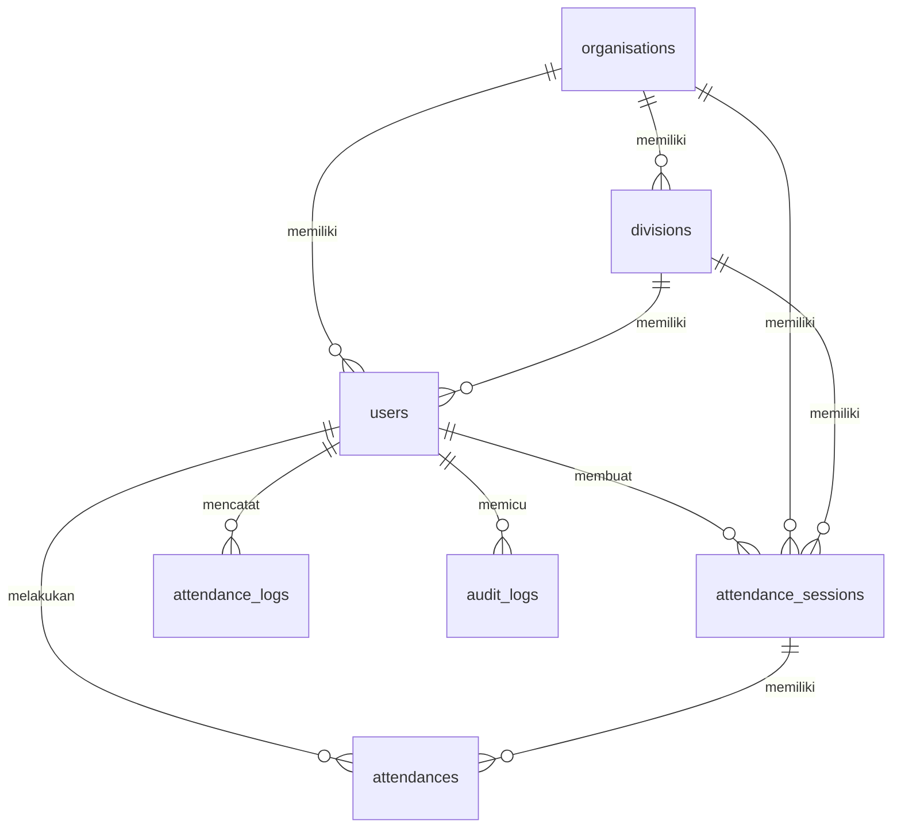

# Dokumentasi Skema Database - Orens Pro

Dokumen ini menjelaskan struktur, kolom, relasi, serta fungsi dari masing-masing tabel database yang digunakan oleh aplikasi **Orens Pro (Sistem Absensi Ekskul Cerdas)**.

---

## 🗺️ Gambaran Umum & Relasi Tabel (ERD)

Secara garis besar, relasi tabel dalam Orens Pro dirancang bertingkat untuk mengakomodasi struktur **Ekskul (Organisations) -> Divisi (Divisions) -> Anggota (Users)** serta pelacakan absensi per sesi.

---

## 📁 1. Tabel-Tabel Inti Bisnis (Core Business Tables)

### A. Tabel `organisations` (Ekstrakurikuler)
Tabel ini merepresentasikan entitas ekstrakurikuler yang ada di sekolah (contoh: *Orens Solution*, *Orens Network*).

| Nama Kolom | Tipe Data | Nullable? | Keterangan / Fungsi |
| :--- | :--- | :---: | :--- |
| `id` | `bigint unsigned` | `No` | Primary key / ID unik organisasi ekskul. |
| `name` | `string(150)` | `No` | Nama ekstrakurikuler. |
| `address` | `text` | `Yes` | Alamat basecamp / sekretariat ekskul. |
| `last_grade_reset_at`| `timestamp` | `Yes` | Waktu reset penilaian keaktifan terakhir oleh Pembina. |
| `description` | `text` | `Yes` | Deskripsi singkat mengenai ekskul. |
| `has_division` | `boolean` | `No` | Status penunjuk apakah ekskul memiliki subdivisi (default: `false`). |
| `created_at` / `updated_at` | `timestamp` | `Yes` | Waktu pembuatan dan pembaruan record. |

---

### B. Tabel `divisions` (Divisi Ekskul)
Divisi spesifik di dalam suatu ekstrakurikuler (contoh: *Game Development* atau *Web Development* di dalam ekskul Orens Solution).

| Nama Kolom | Tipe Data | Nullable? | Keterangan / Fungsi |
| :--- | :--- | :---: | :--- |
| `id` | `bigint unsigned` | `No` | Primary key / ID unik divisi ekskul. |
| `organisation_id` | `bigint unsigned` | `No` | Foreign key ke tabel `organisations`. Hapus otomatis jika ekskul dihapus (*cascade*). |
| `name` | `string(150)` | `No` | Nama divisi. |
| `description` | `text` | `Yes` | Deskripsi tugas atau fokus divisi. |
| `created_at` / `updated_at` | `timestamp` | `Yes` | Waktu pembuatan dan pembaruan record. |

---

### C. Tabel `users` (Pengguna Sistem)
Tabel untuk menyimpan data semua pengguna aplikasi dengan 4 role (Superadmin, Pembina, Pengurus, Member).

| Nama Kolom | Tipe Data | Nullable? | Keterangan / Fungsi |
| :--- | :--- | :---: | :--- |
| `id` | `bigint unsigned` | `No` | Primary key / ID unik pengguna. |
| `organisation_id` | `bigint unsigned` | `Yes` | Foreign key ke tabel `organisations`. Jika organisasi dihapus, kolom ini diset `null`. |
| `division_id` | `bigint unsigned` | `Yes` | Foreign key ke tabel `divisions`. Jika divisi dihapus, kolom ini diset `null`. |
| `name` | `string` | `No` | Nama lengkap siswa atau guru/pembina. |
| `email` | `string` | `No` | Alamat email (wajib unik, dibatasi untuk domain `@smkprestasiprima.sch.id` atau `@smaprestasiprima.sch.id`). |
| `email_verified_at` | `timestamp` | `Yes` | Waktu verifikasi email (jika digunakan). |
| `password` | `string` | `No` | Hash password pengguna. |
| `phone` | `string(30)` | `Yes` | Nomor telepon/WhatsApp. |
| `role` | `string(30)` | `No` | Hak akses sistem: `superadmin`, `pembina`, `pengurus`, atau `member`. |
| `is_active` | `boolean` | `No` | Status keaktifan akun (default: `true`). Jika `false`, user tidak bisa login. |
| `remember_token` | `string(100)` | `Yes` | Token session untuk fitur "Remember Me" saat login. |
| `created_at` / `updated_at` | `timestamp` | `Yes` | Waktu pembuatan dan pembaruan record. |

---

### D. Tabel `attendance_sessions` (Sesi Presensi Ekskul)
Sesi absensi spesifik yang dibuat oleh Pengurus atau Pembina (contoh: *Pertemuan Rapat Mingguan*, *Latihan Rutin*).

| Nama Kolom | Tipe Data | Nullable? | Keterangan / Fungsi |
| :--- | :--- | :---: | :--- |
| `id` | `bigint unsigned` | `No` | Primary key / ID unik sesi absensi. |
| `organisation_id` | `bigint unsigned` | `Yes` | Ekskul penyelenggara sesi (Foreign key `organisations`, diset `null` jika dihapus). |
| `division_id` | `bigint unsigned` | `Yes` | Divisi penyelenggara sesi (jika sesi bersifat divisi khusus. Foreign key `divisions`). |
| `title` | `string(200)` | `Yes` | Nama atau judul kegiatan. |
| `qr_token` | `string` | `No` | Token statis unik yang digunakan sebagai kunci *HMAC-SHA256* untuk rotasi QR Code dinamis. |
| `session_date` | `date` | `No` | Tanggal dilaksanakannya sesi. |
| `start_time` | `time` | `Yes` | Jam mulai absen dibuka. |
| `end_time` | `time` | `Yes` | Jam selesai absen (sesi ditutup). |
| `latitude` | `decimal(10,7)` | `Yes` | Garis lintang (GPS) titik pusat absensi. |
| `longitude` | `decimal(10,7)` | `Yes` | Garis bujur (GPS) titik pusat absensi. |
| `radius` | `integer` | `Yes` | Radius toleransi jarak aman absensi dalam satuan meter (misal: `100` meter). |
| `is_active` | `boolean` | `No` | Menunjukkan apakah sesi absensi sedang aktif menerima check-in. |
| `created_by` | `bigint unsigned` | `No` | ID Pengguna yang membuat sesi (Foreign key `users`, dihapus otomatis jika pembuat dihapus). |
| `created_at` / `updated_at` | `timestamp` | `Yes` | Waktu pembuatan dan pembaruan record. |

---

### E. Tabel `attendances` (Data Presensi Anggota)
Tabel transaksi utama yang mencatat kehadiran siswa di suatu sesi absensi.

| Nama Kolom | Tipe Data | Nullable? | Keterangan / Fungsi |
| :--- | :--- | :---: | :--- |
| `id` | `bigint unsigned` | `No` | Primary key / ID unik transaksi kehadiran. |
| `user_id` | `bigint unsigned` | `No` | ID siswa yang hadir (Foreign key `users`, dihapus otomatis jika user dihapus). |
| `session_id` | `bigint unsigned` | `No` | ID Sesi absensi terkait (Foreign key `attendance_sessions`, dihapus otomatis jika sesi dihapus). |
| `checkin_time` | `timestamp` | `Yes` | Waktu persis siswa menekan tombol check-in. |
| `latitude` | `decimal(10,7)` | `Yes` | Koordinat latitude posisi perangkat siswa saat check-in. |
| `longitude` | `decimal(10,7)` | `Yes` | Koordinat longitude posisi perangkat siswa saat check-in. |
| `distance` | `integer` | `Yes` | Jarak perangkat ke titik pusat sesi absensi (dalam meter) saat validasi dilakukan. |
| `status` | `string(30)` | `Yes` | Status absensi: `hadir`, `sakit`, `izin`, atau `alpha` (diisi otomatis oleh sistem jika telat scan). |
| `created_at` / `updated_at` | `timestamp` | `Yes` | Waktu pembuatan dan pembaruan record. |

---

## 🔒 2. Tabel Keamanan & Log (Security & Audit Trail)

### A. Tabel `attendance_logs` (Log Percobaan Absensi)
Mencatat setiap percobaan pindai QR yang dilakukan member (baik yang berhasil maupun yang gagal verifikasi GPS/QR).

| Nama Kolom | Tipe Data | Nullable? | Keterangan / Fungsi |
| :--- | :--- | :---: | :--- |
| `id` | `bigint unsigned` | `No` | Primary key log. |
| `user_id` | `bigint unsigned` | `Yes` | ID siswa yang mencoba absen (Foreign key `users`, diset `null` jika dihapus). |
| `qr_token` | `string` | `No` | Token QR yang dikirimkan oleh siswa saat pemindaian. |
| `latitude` | `decimal(10,7)` | `Yes` | Koordinat GPS yang dikirim siswa saat mencoba absen. |
| `longitude` | `decimal(10,7)` | `Yes` | Koordinat GPS yang dikirim siswa saat mencoba absen. |
| `result` | `text` | `Yes` | Hasil validasi (contoh: "Presensi berhasil" atau "Anda berada terlalu jauh dari lokasi absensi"). |
| `created_at` / `updated_at` | `timestamp` | `Yes` | Waktu terjadinya log. |

---

### B. Tabel `audit_logs` (Audit Trail Aktivitas Admin)
Mencatat aktivitas perubahan data krusial di sistem (seperti menambah user, menghapus sesi, meriset grade keaktifan) demi akuntabilitas.

| Nama Kolom | Tipe Data | Nullable? | Keterangan / Fungsi |
| :--- | :--- | :---: | :--- |
| `id` | `bigint unsigned` | `No` | Primary key log audit. |
| `user_id` | `bigint unsigned` | `Yes` | ID admin yang melakukan aksi (Foreign key `users`, diset `null` jika dihapus). |
| `event` | `string` | `No` | Jenis aksi yang dilakukan: `created`, `updated`, `deleted`, `login`, `logout`. |
| `auditable_type` | `string` | `Yes` | Nama model yang dimanipulasi (contoh: `App\Models\User` atau `App\Models\AttendanceSession`). |
| `auditable_id` | `bigint unsigned` | `Yes` | ID baris tabel model yang dimanipulasi. |
| `old_values` | `json` | `Yes` | Data lama sebelum diubah (format JSON). |
| `new_values` | `json` | `Yes` | Data baru setelah diubah (format JSON). |
| `ip_address` | `string` | `Yes` | Alamat IP pembuat aksi. |
| `user_agent` | `text` | `Yes` | Browser/Perangkat yang digunakan pembuat aksi. |
| `created_at` / `updated_at` | `timestamp` | `Yes` | Waktu log dicatat. |

---

## ⚙️ 3. Tabel Framework & Antrean (Laravel Infrastructure Tables)

Tabel-tabel ini dibuat otomatis oleh Laravel Core untuk mendukung kinerja sistem di belakang layar.

1.  **`password_reset_tokens`:** Menyimpan token unik sementara ketika pengguna mengajukan lupa password.
2.  **`sessions`:** Menyimpan status session pengguna yang sedang login (termasuk Payload data, IP Address, dan waktu aktivitas terakhir) saat Laravel dikonfigurasi menggunakan database session driver.
3.  **`cache` / `cache_locks`:** Digunakan oleh Laravel Cache Driver untuk menyimpan data caching (seperti caching laporan multi-sesi) agar server tidak melakukan query database berat berulang kali.
4.  **`jobs` / `job_batches` / `failed_jobs`:** Menyimpan antrean tugas (*Queue*) yang berjalan di background (seperti pembersihan sesi kedaluwarsa atau pengiriman email) sehingga tidak menghambat pemuatan halaman di browser pengguna.
