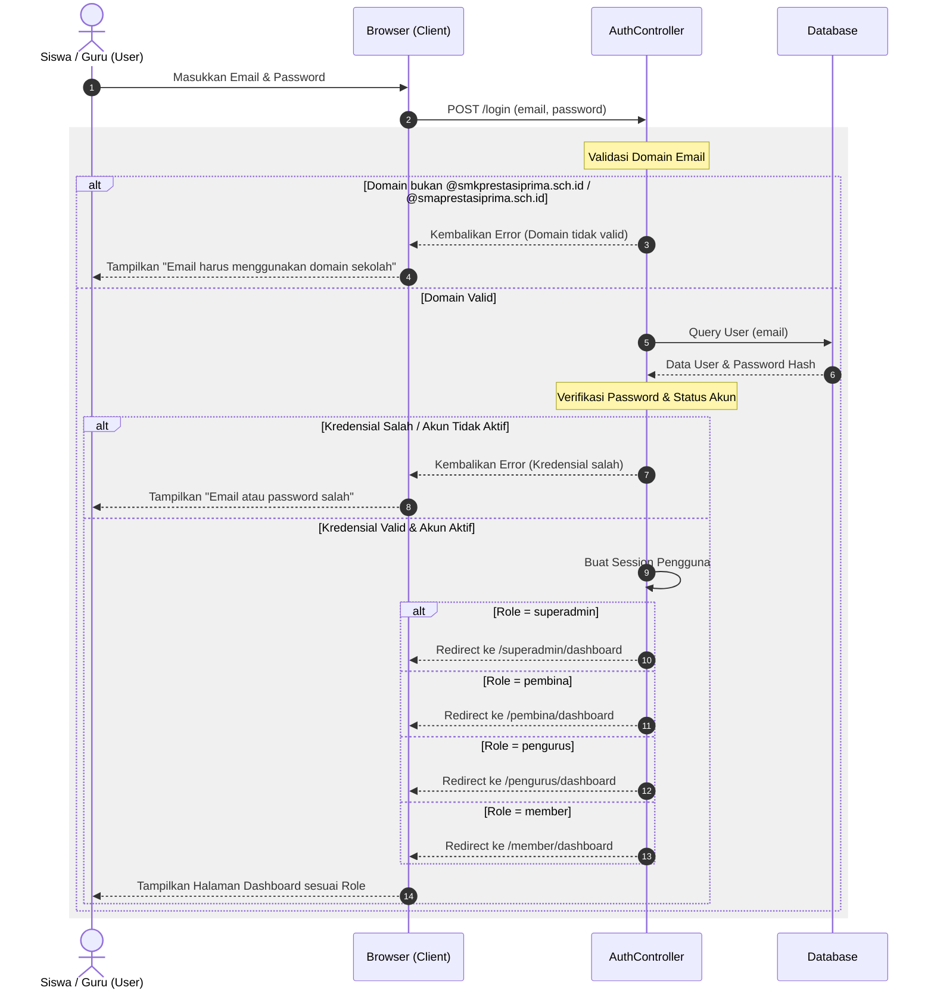
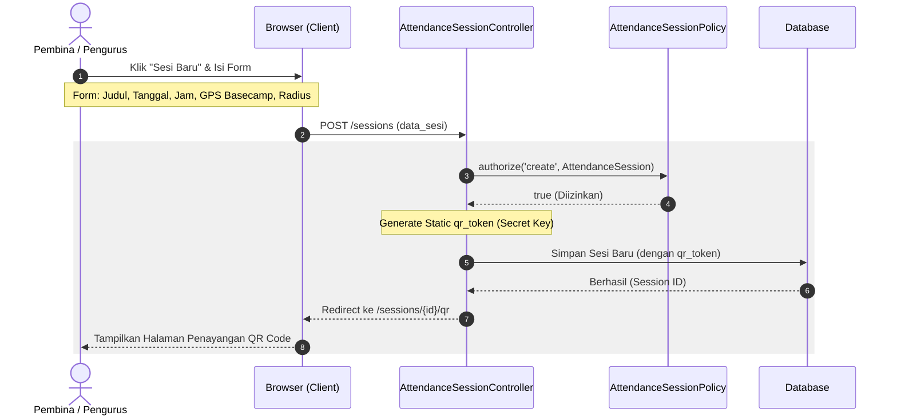
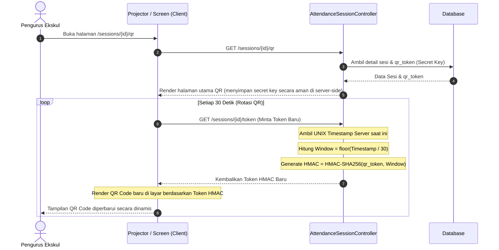
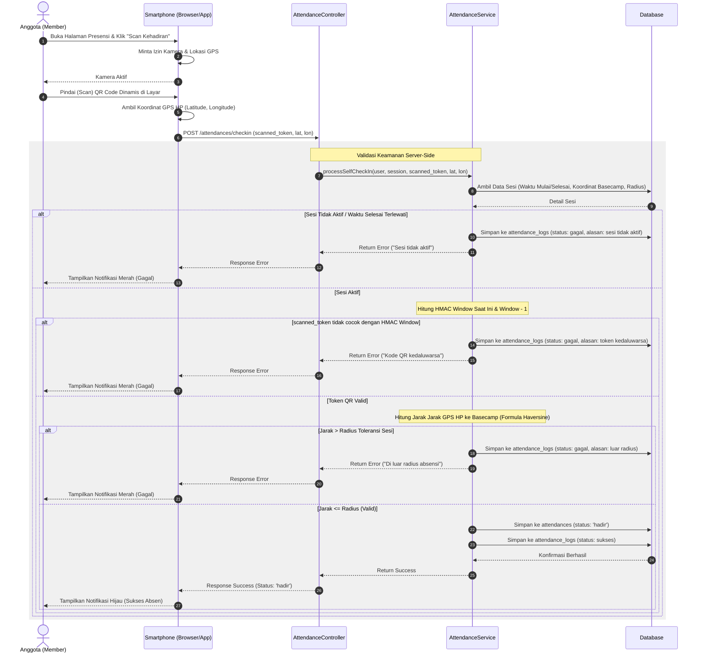
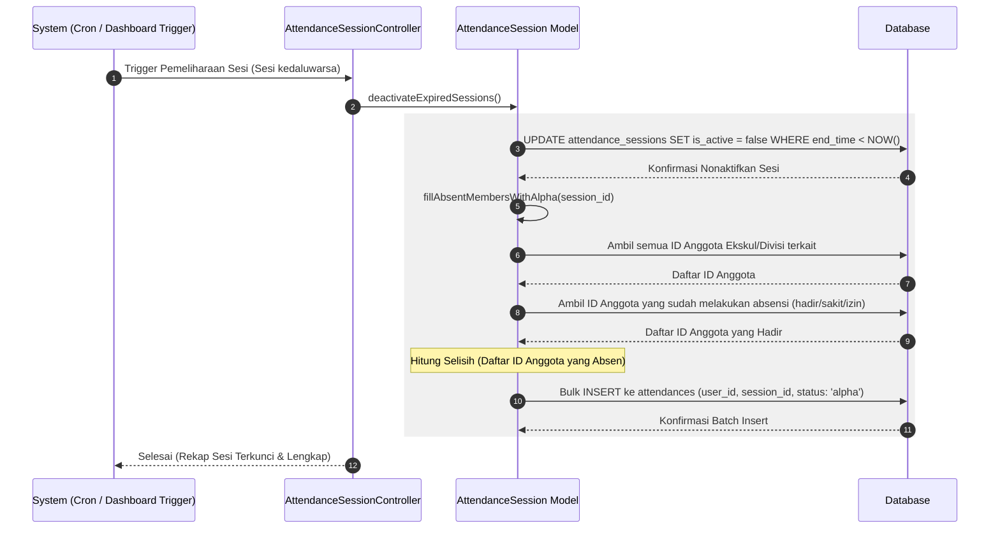
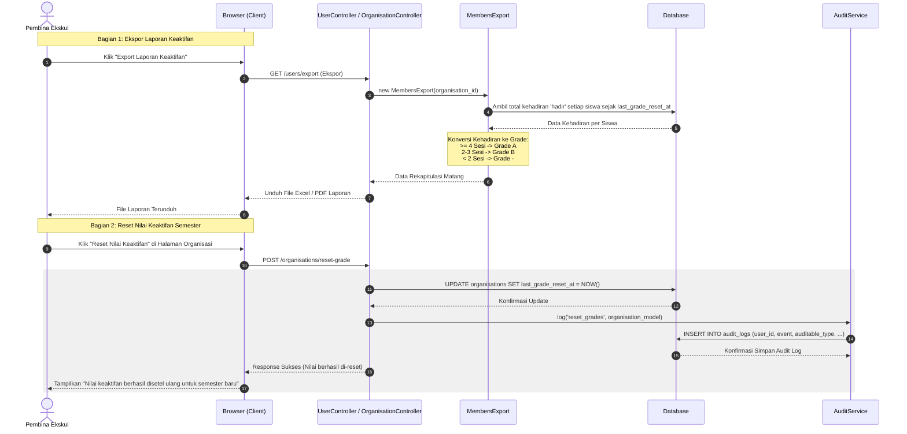

# Orens Pro - UML Sequence Diagrams

Dokumen ini berisi spesifikasi 6 diagram urutan (**Sequence Diagrams**) untuk alur utama aplikasi **Orens Pro**. Diagram ini dirancang berdasarkan alur kerja (activity/flowchart) sistem absensi eksternal pintar terverifikasi.

Anda dapat menyalin kode Mermaid di bawah ini ke editor Markdown pendukung atau [Mermaid Live Editor](https://mermaid.live) untuk visualisasi interaktif.

---

## 1. Sequence Diagram: Autentikasi & Pengalihan Dashboard (Login)

Menggambarkan alur autentikasi pengguna berdasarkan domain email sekolah dan pengalihan ke dashboard yang sesuai dengan peran (Role-Based Access Control).

---

## 2. Sequence Diagram: Pembuatan Sesi (Membuat Sesi)

Menggambarkan alur ketika Pembina atau Pengurus membuat sesi pertemuan ekskul baru lengkap dengan konfigurasi lokasi geofencing.

---

## 3. Sequence Diagram: Generator QR Dinamis (QR Code)

Menggambarkan alur pembuatan token QR dinamis berbasis waktu (berotasi otomatis setiap 30 detik menggunakan rahasia `qr_token`).

---

## 4. Sequence Diagram: Presensi Mandiri & Geofencing

Menggambarkan proses verifikasi berlapis di sisi server ketika anggota (Member) melakukan check-in menggunakan GPS dan memindai QR dinamis.

---

## 5. Sequence Diagram: Penutupan Sesi Otomatis (Otomasi Status Alpha)

Menggambarkan alur otomatisasi pengisian status 'alpha' secara retroaktif bagi siswa yang tidak melakukan check-in setelah sesi presensi berakhir.

---

## 6. Sequence Diagram: Rekapitulasi Laporan & Reset Nilai (Export Laporan)

Menggambarkan proses ekspor rekapitulasi kehadiran kumulatif menjadi nilai keaktifan (Grade A / B / -) serta mekanisme pembersihan (reset) di akhir semester.

